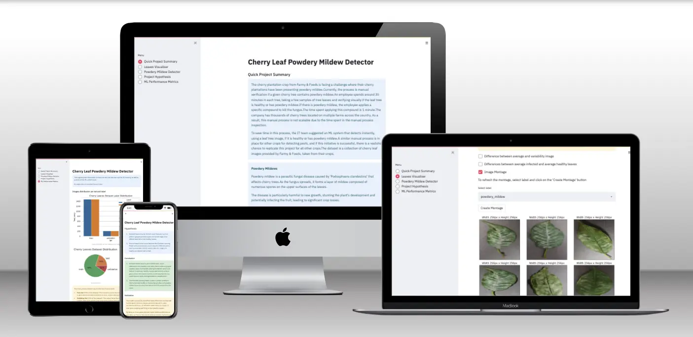

# Powdery Mildew Detection in Cherry Leaves

## Table of Contents
1. [Dataset Content](#dataset-content)
2. [Business Requirements](#business-requirements)
3. [Epics and User Stories](#epics-and-user-stories)
4. [Hypothesis and Validation](#hypothesis-and-validation)
5. [Implementation of the Business Requirements](#the-rationale-to-map-the-business-requirements-to-the-data-visualizations-and-ml-tasks)
6. [ML Business Case](#ml-business-case)
7. [Model Summary](#model-summary)
8. [Dashboard Design](#dashboard-design)
9. [CRISP DM Process](#crisp-dm)
10. [Deployment](#deployment)
11. [Technologies Used](#technogies-used)
12. [Credits](#credits)

## Deployed App
[Mildew-detection-in-cherry-leaves on heroku](https://powdery-mildew-detector-d26b913cda1a.herokuapp.com/)

## Dataset Content

- The dataset is sourced from [Kaggle](https://www.kaggle.com/codeinstitute/cherry-leaves).
- The dataset contains 4208 images taken from the client's crop fields. The images show healthy cherry leaves and cherry leaves that have powdery mildew, a fungal disease that affects many plant species. 

## Business Requirements

The cherry plantation crop from Farmy & Foods is facing a challenge where their cherry plantations have been presenting powdery mildew. Currently, the process is manual verification if a given cherry tree contains powdery mildew. An employee spends around 30 minutes in each tree, taking a few samples of tree leaves and verifying visually if the leaf tree is healthy or has powdery mildew. If there is powdery mildew, the employee applies a specific compound to kill the fungus. The time spent applying this compound is 1 minute. The company has thousands of cherry trees located on multiple farms across the country. As a result, this manual process is not scalable due to the time spent in the manual process inspection.

To save time in this process, the IT team suggested an ML system that detects instantly, using a leaf tree image, if it is healthy or has powdery mildew. A similar manual process is in place for other crops for detecting pests, and if this initiative is successful, there is a realistic chance to replicate this project for all other crops. The dataset is a collection of cherry leaf images provided by Farmy & Foods, taken from their crops.

The cherry plantation crop is one of the finest products in their portfolio, and the company is concerned about supplying the market with a compromised quality product.

- 1 - The client is interested in conducting a study to visually differentiate a healthy cherry leaf from one with powdery mildew.
- 2 - The client is interested in predicting if a cherry leaf is healthy or contains powdery mildew.
- 3 - The client is interested in obtaining a prediction report for newly examined leaves.

## Epics and User Stories
The project has been divided into five main Epics each consisting of several User Stories; illustrated below including criteria for completion.
### **Epic 1**: Information Gathering and Data Collection
1. **User Story 1**: As a Data Collector, I can gather data from external sources to ensure a comprehensive dataset for analysis.
   * Download the cherry_leaves data set from Kaggle and add to repository.
2. **User Story 2**: As a Data Analyst/Engineer, I can clean and preprocess the raw data so that it is ready for visualization and modeling.
    * Remove any non-images.
    * Sort data into Train, Validation and Test sets.

### **Epic 2**: Data Visualization, Cleaning, and Preparation
1. **User Story 1**: As a Data Analyst, I can create visual representations of the dataset to identify trends, outliers, and patterns.
     * Compute and display figures for average size of images in the dataset.
2. **User Story 2**: As a Data Scientist, I can normalize and transform the data to ensure compatibility with various machine learning models.
    * Compute and display figures showing 'mean' and 'standard deviation' of images in the dataset.
    * Create an image montage of healthy ad unhealthy leaves from the dataset.
3. **User Story 3**: As a Business Analyst, I can interpret the visualized data to generate insights and recommendations for decision-making.
    * Based on image analysis, make case for ML Model.
4. **User Story 4**: As a client I can view images that display the differences between an average healthy and infected cherry leaf so I can better understand the differences in displayed symptoms.
    * Within the dashboard, figures of average image size, 'mean' and 'standard deviation' are viewable.
5. **User Story 5**: As a client I can view a montage of cherry leaves that are either healthy or unhealthy so that I can better understand the differences in displayed symptoms.
    * Within the dashboard, a montage of either healthy or unhealthy leaves can be viewed.

### **Epic 3**: Model Training, Validation, and Optimization
1. **User Story 1**: As a Data Scientist, I can train machine learning models on the dataset to predict key metrics.
    * ML Model built and trained on the cherry_leaves dataset
    * The training scriptlogs key metrics (training accuracy, loss and time taken)
2. **User Story 2**: As a Data Scientist, I can validate the performance of trained models to ensure accuracy and generalizability.
    * The model's perormance is validated using the validation dataset.
    * The model demonstartes generalisability by acheiving at least 97% performance on unseen data.
    * A confusion matrix is provided to help assess model performance.
3. **User Story 3**: As a Data Engineer, I can optimize the model's hyperparameters to improve performance and reduce overfitting.
    * Selected hyperparameters are adjusted to improve models performance.
    * Over/Under fitting is controlled.
4. **User Story 4**: As a client I want a ML Model that will predict, with an accuracy of at least 97%, whether a cherry leaf is healthy or displaying symptoms of powdery mildew.
    * The final ML Model acheives over 97% accuracy on the test dataset.
    * The data set is balanced.

### **Epic 4**: Dashboard Planning, Designing, and Development
1. **User Story 1**: As a UX Designer, I can design a user-friendly dashboard layout to present data in an easily accessible format.
    * Dashboard layout succesfully implemented.
2. **User Story 2**: As a Developer, I can integrate data sources into the dashboard to ensure real-time updates.
    * File Uploader widget functioning.
3. **User Story 3**: As a client I can obtain a fully interactive dashboard so I can view and review the necessary data.
    * Dashboard layout successfully implemented.
    * All data and results clearly visable to user.
4. **User Story 4**: As a client I can view and download a report so that I can obtain results of an ML prediction.
    * Report is downloadable from the Streamlit dashboard.

### **Epic 5**: Dashboard Deployment and Release
1. **User Story 1**: As a DevOps Engineer, I can deploy the dashboard on a secure cloud platform to ensure scalability and availability.
    * Streamlit Dashboard app successfully deployed to Heroku
2. **User Story 2**: As a QA Engineer, I can test the dashboard’s functionality to ensure it works correctly before releasing it to stakeholders.
    ** All functions of the streamlit dashboard work as expected.
3. **User Story 3**: As a Project Manager, I can release the dashboard to end-users with proper documentation and training to facilitate its use.
    * Once product deployed to Heroku it can be supplied to the client.
    * Documentation is created - readme.md

## Hypothesis and Validation

* Infected leaves display distinct visual features, such as white or grayish powdery spots and curled edges, that differentiate them from healthy leaves.
    - **Validation**: Conduct research about the symptoms borught on by the affects of powdery mildew. Build an average image study to aid the ivestigation and highlight any clear visual indicators of the disease.

* Due to these distinct visual features, the Machine Learning Model with a convolutional neural network (CNN) should be able to accurately classify unseen data (an image of a healthy or infected cherry leaf).

    - **Validation**: Build a machine learning model to evaluate its performance on both training and unseen validation datasets. The process involves the following steps:

        1. **Data Preparation**: Split the dataset into training, validation, and test sets. Preprocess the images (resizing, normalization, and augmentation) to ensure consistency.
        
        2. **Model Architecture**: Design a CNN architecture tailored for image classification. It should include convolutional layers for feature extraction, max pooling for down-sampling, and fully connected layers for classification.
        
        3. **Training**: Train the model using the training dataset, adjusting hyperparameters like learning rate, batch size, and optimizer (e.g., Adam or Adagrad). Incorporate techniques like dropout to prevent overfitting.
        
        4. **Validation**: Use the validation dataset to monitor the model's performance during training. Evaluate metrics such as accuracy, precision, recall, and F1-score to assess how well the model distinguishes between healthy and infected cherry leaves.
        
        5. **Testing and Evaluation**: Once the model is trained, test its performance on the unseen test dataset. The goal is to achieve a high generalization ability with minimal overfitting.
        
        6. **Model Tuning**: Depending on the validation results, fine-tune the model by adjusting hyperparameters or modifying the architecture to improve accuracy and reduce error rates.

        7. **Deployment**: After achieving satisfactory performance, the model can be deployed in a real-world scenario to classify cherry leaves in agricultural environments for disease monitoring and intervention.

## Rationale to map the business requirements to the Data Visualisations and ML tasks

### * **Business Requirement 1:** Data Visualisation
> The client is interested in conducting a study to visually differentiate a healthy cherry leaf from one with powdery mildew.

**User Stories**
- As a client I can obtain a fully interactive dashboard so I can view and review the necessary data.
- As a client I can view images that display the differences between an average healthy and infected cherry leaf so I can better understand the differences in displayed symptoms.
- As a client I can view a montage of cherry leaves that are either healthy or unhealthy so that I can better understand the differences in displayed symptoms.

To meet this requirement a Streamlit dashboard will be created and include the following functions:
- Display the "mean" and "standard deviation" images for infected and uninfected cherry leaves.
- Display the difference between average infected and uninfected cherry leaves.
- Display an image montage for either infecetd or uninfected leaves.

### * **Business Requirement 2:** Classification
>The client is interested in predicting if a cherry leaf is healthy or contains powdery mildew.

**User Stories**
- As a client I want a ML Model that will predict, with an accuracy of at least 97%, whether a cherry leaf is healthy or displaying symptoms of powdery mildew.

To meet this requirement an ML Model will be built and deployed and the following functionality will be added to the streamlit dashboard:
- An uploader widget will allow the client to upload one or multiple .jpg images. The model will then predict whether the leaf is healthy or showing signs of powdery mildew infection.
- A report of the results will be displayed.

### * **Business Requirement 3:** Reporting
>The client is interested in obtaining a prediction report for newly examined leaves.

**User Stoires**
- As a client I can view and download a report so that I can obtain results of an ML prediction.

To meet this requirement the following functionlality will be added to the streamlit dashboard:
- A report of the results will be displayed.
- A csv version of the report will be downloadable by the client.

## ML Business Case

### Cherry Leaf Powdery Mildew Classifier (Clf)
* We want a machine learning (ML) model to predict whether a leaf is infected with powdery mildew or not based on historical image data. This is a binary classification problem where there are two possible outcomes for each image:
    * **Infected:** Leaf displays signs of powdery mildew infection.
    * **Not infected:** Leaf shows no sign of powdery mildew infection.
* It will be a supervised model, and a 2-class, single-label classification model. This means there are two classes (Infected and Not Infected) and each image can only belong to one class; either Infected or Not Infected, but not both at the same time.
* The ideal outcome would be to provide the client with fast and reliable method of detecting powdery mildew infection.
* The client has agreed that the model sucess metrics are:
    * Accuracy of 97% or above on the test set.
* The model output is designed as a flag, indicating if the cherry leaf is healthy or contains powdery mildew. Staff at the clients facilities will upload pictures to the app and the prediction will be made on the fly.
* Heuristics: The current diagnostic requires staff to conduct a detailed inspection of each tree, taking samples and visually verifying whether signs of powdery mildew are present. This is time consuming and leaves room for diagnostic inaccuracies due to human error.
* The training data to fit the model comes from [Kaggle](https://www.kaggle.com/datasets/codeinstitute/cherry-leaves). The dataset contains 4208 images - 2104 show healthy cherry leaves, 2104 show leaves containing powdery mildew.

## Model Summary
### Summary
The CNN model is structured with three convolutional blocks, followed by dense layers that process increasingly complex features from image input. Regularization techniques like batch normalization, dropout, and L2 regularization help prevent overfitting. The model is compiled for binary classification using categorical crossentropy and the Adagrad optimizer.

### 1. **Convolutional Layers**
   - **Convolutional Block 1**
     - `Conv2D(filters=32, kernel_size=(3,3), activation='relu')`: 
       - **Filters (32)**: The model uses 32 filters to detect different patterns (e.g., edges, textures) in the input images.
       - **Kernel size (3x3)**: A 3x3 filter size balances detecting small features while preserving spatial context.
       - **Activation ('relu')**: ReLU introduces non-linearity and helps to reduce the vanishing gradient problem.
     - `BatchNormalization()`: Normalizes activations, making training more stable and faster by reducing internal covariate shift.
     - `MaxPooling2D(pool_size=(2,2))`: Reduces spatial dimensions by downsampling, retaining important features and reducing computation.
  
   - **Convolutional Block 2**
     - `Conv2D(filters=64, kernel_size=(3,3), activation='relu')`: Similar to Block 1, but uses 64 filters to learn more complex features.
     - `BatchNormalization()` and `MaxPooling2D(pool_size=(2,2))`: Serve the same purpose as in Block 1.

   - **Convolutional Block 3**
     - `Conv2D(filters=128, kernel_size=(3,3), activation='relu')`: At this deeper level, 128 filters are used to capture even more complex patterns.
     - `BatchNormalization()` and `MaxPooling2D(pool_size=(2,2))`: The same approach is used to normalize and downsample features.

### 2. **Flattening and Fully Connected Layers**
   - `Flatten()`: Converts the 2D feature maps into a 1D vector to prepare data for the dense layers.
   - `Dense(64, activation='relu')`: A fully connected layer with 64 neurons and ReLU activation for non-linearity.
     - **Kernel Regularizer (`l2(0.01)`)**: L2 regularization prevents overfitting by penalizing large weights, promoting simpler models.
   - `Dropout(0.6)`: Drops 60% of the neurons during training to prevent overfitting and improve generalization.

### 3. **Output Layer**
   - `Dense(2, activation='softmax')`: 
     - **Neurons (2)**: The output layer has 2 neurons, indicating a **binary classification** problem.
     - **Activation ('softmax')**: Softmax produces output values as probabilities, appropriate for multi-class or binary classification.

### 4. **Compilation**
   - **Loss ('categorical_crossentropy')**: Suitable for multi-class classification tasks, even for binary classification.
   - **Optimizer ('adagrad')**: Adagrad adjusts the learning rate dynamically for each parameter, used here to compare performance in smaller dataset.
   - **Metrics ('accuracy')**: Accuracy is used to monitor the model's performance during training and evaluation.

---

## Dashboard Design
### **Page 1: Project Summary**

- Project Summary

    - General Information

        - Powdery Mildew is a plant disease that causes a powdery growth on the surface of leaves, buds, young shoots, flowers and fruits. 
        - Leaves commonly turn yellow and wither, flowers are distorted or fewer in number, and fruit yield and quality are reduced. [Britanica](https://www.britannica.com/science/powdery-mildew)

    - Project Dataset

        - The cherry_leaves dataset [Kaggle](https://www.kaggle.com/datasets/codeinstitute/cherry-leaves) contains 4208 images (photographs of cherry tree leaves). 2104 images show healthy cherry leaves, 2104 images show leaves containing powdery mildew.

    - Link to Additional Information

        - [Royal Horticultural Society](https://www.rhs.org.uk/disease/powdery-mildews)

    - Business Requirements

        - The client is interested in conducting a study to visually differentiate a healthy cherry leaf from one with powdery mildew.
        - The client is interested in predicting if a cherry leaf is healthy or contains powdery mildew.

### **Page 2: Cherry Tree Leaf Visualiser**

- To Answer Business Requirement 1: The client is interested in conducting a study to visually differentiate a healthy cherry leaf from one with powdery mildew.

    - Checkbox 1 - Display the difference between average and variability as an image.
    - Checkbox 2 - Display the differences between healthy cherry tree leaves and those containing powdery mildew.
    - CHeckbox 3 - Image Montage - Display a montage of images from the dataset. Filterable by Healthy/Infected.

### **Page 3: Powdery Mildew Detector**

- To Answer Business Requirement 2: The client is interested in predicting if a cherry leaf is healthy or contains powdery mildew.

    - Link to download a set of images to use for live prediction.
        - [kaggle - cherry_leaves](https://www.kaggle.com/datasets/codeinstitute/cherry-leaves)
    
    - File Uploader Widget
        - Allows the user to upload one or multiple images. 
        - For each image the widget will display the image and a prediction statement, indicating if a cherry leaf is healthy or contains powdery mildew. The probabbiliy associated with this statement will be displayed.
        - A table containing the image name and prediction results.
        - A button allowing user to download the results table.

### **Page 4: Project Hypothesis and Validation**

- Project Hypothesis

    - Describe conclusion
    - Describe validation

### **Page 5: ML Performance Metrics**

- Label Frequencies for Train, Validation and Test sets
    
- Model History - Accuracy and Losses
    
- Model Evaluation Result

## CRISP-DM

CRISP-DM, which stands for Cross-Industry Standard Process for Data Mining, is an industry-proven way to guide your data mining efforts.

* As a **methodology**, it includes descriptions of the typical phases of a project, the tasks involved with each phase, and an explanation of the relationships between these tasks.
* As a **process model**, CRISP-DM provides an overview of the data mining life cycle.

Source: [CRISP-DM Help Overview - IBM](https://www.ibm.com/docs/en/spss-modeler/saas?topic=dm-crisp-help-overview)

    
## Deployment

### Heroku

- The App live link is: `https://powdery-mildew-detector-d26b913cda1a.herokuapp.com/`
- Set the runtime.txt Python version to a [Heroku-20](https://devcenter.heroku.com/articles/python-support#supported-runtimes) stack currently supported version.
- The project was deployed to Heroku using the following steps.

1. Log in to Heroku and create an App
2. At the Deploy tab, select GitHub as the deployment method.
3. Select your repository name and click Search. Once it is found, click Connect.
4. Select the branch you want to deploy, then click Deploy Branch.
5. The deployment process should happen smoothly if all deployment files are fully functional. Click the button Open App on the top of the page to access your App.
6. If the slug size is too large, then add large files not required for the app to the .slugignore file.

## Technogies Used

### Main Data Analysis and Machine Learning Libraries

- **joblib**: A library for efficient serialization of Python objects and parallel computation, used for saving machine learning models and caching results.

- **pandas**: A data manipulation and analysis library that provides data structures like DataFrames for working with the dataset.

- **numpy**: A library for numerical computing in Python, providing support for arrays, matrices, and high-level mathematical functions.

- **matplotlib**: A plotting library for creating static, animated, and interactive visualizations in Python.

- **seaborn**: Built on top of `matplotlib`, Seaborn was used for creating informative statistical graphics with better default aesthetics.

- **tensorflow**: An open-source machine learning framework used for building and training the learning model.

- **tensorflow.keras.preprocessing**: A collection of data preprocessing utilities used for image processing and preparation.

- **ImageDataGenerator**: A class from Keras used for augmenting and generating batches of image data.

- **tensorflow.keras.models.Sequential**: A Keras model where layers are stacked sequentially, used for building the neural networks of the CNN model.

- **tensorflow.keras.layers**
  - **Activation**: Applies an activation function to an output, transforming inputs in a neural network layer (e.g., ReLU, sigmoid).
  - **Dropout**: A regularization layer that randomly sets a fraction of input units to zero to prevent overfitting.
  - **Flatten**: Converts multi-dimensional inputs into a 1D vector, often used before fully connected layers.
  - **Dense**: A fully connected layer where each neuron is connected to every neuron in the previous layer.
  - **Conv2D**: A 2D convolutional layer, commonly used in image processing tasks for feature extraction.
  - **MaxPooling2D**: A pooling layer that reduces the spatial dimensions of the feature maps, retaining the most important information.
  - **BatchNormalization**: Normalizes the inputs of a layer to improve training stability and performance.

- **tensorflow.keras.optimizers**
  - **RMSprop**: An optimizer that divides the learning rate by an exponentially decaying average of squared gradients, improving performance in non-stationary settings.
  - **Adagrad**: An adaptive learning rate optimizer that adjusts the learning rate for each parameter based on the magnitude of past gradients.
  - **Adam**: A widely used optimizer that combines the benefits of Adagrad and RMSprop, offering efficient and adaptive gradient updates.

- **tensorflow.keras.regularizers**
  - **l2**: A regularization technique that adds a penalty proportional to the square of the weights, helping prevent overfitting by discouraging large weight values.

### Other Technologies/Languages

- **python 3.8.18**
- **Gitpod**
- **GitHub**
- **jupyter notebooks**
- **MarkDown**
- **Heroku**

## Credits

### Content

- The template used for this project belongs to CodeInstitute. [Link to template](https://github.com/Code-Institute-Solutions/milestone-project-mildew-detection-in-cherry-leaves)

- Code for several fundtions taken from Code Institute Course content [Walkthrough 1: Malaria Detector](https://learn.codeinstitute.net/courses/course-v1:code_institute+CI_DA_ML+2021_Q4/courseware/07a3964f7a72407ea3e073542a2955bd/29ae4b4c67ed45a8a97bb9f4dcfa714b/)

- Model learning Curve - C is from [Stack Overflow](https://stackoverflow.com/questions/41908379/keras-plot-training-validation-and-test-set-accuracy) by [Tim Seed](https://stackoverflow.com/users/3257992/tim-seed)

### Media

- Additional information on powdery mildew from:
    - [Royal Horticultural Society](https://www.rhs.org.uk/disease/powdery-mildews)
    - [Britanica](https://www.britannica.com/science/powdery-mildew)